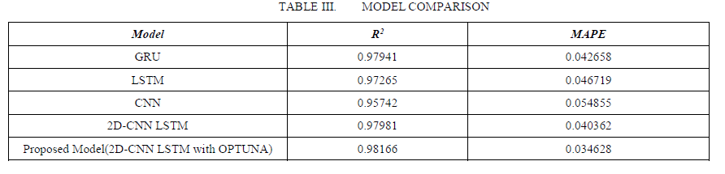
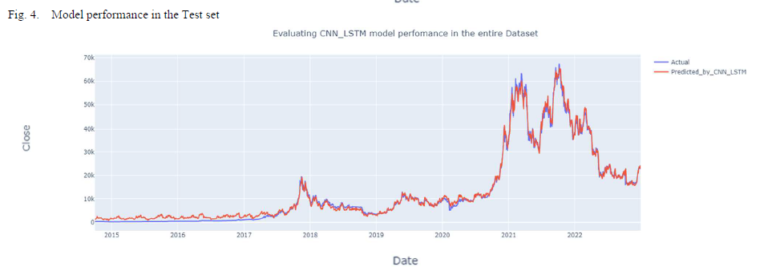

# Real-Time Bitcoin Price Prediction using Hybrid 2D-CNNLSTM Model

The code repository for "Real-Time Bitcoin Price Prediction using Hybrid 2D-CNNLSTM Model" [paper](https://ieeexplore.ieee.org/abstract/document/10139275/) (ICWR 2023). If you use any content of this repo for your work, please cite the following bib entry:
  
    @inproceedings{
        10139275,
        author={Kazeminia, Saman and Sajedi, Hedieh and Arjmand, Masoud},
        booktitle={2023 9th International Conference on Web Research (ICWR)}, 
        title={Real-Time Bitcoin Price Prediction Using Hybrid 2D-CNN LSTM Model}, 
        year={2023},
        pages={173-178},
        doi={10.1109/ICWR57742.2023.10139275}
    }

## Real-Time Bitcoin Price Prediction using Hybrid 2D-CNNLSTM Model

Due to the growing importance of the cryptocurrency market, as well as the diversity and expansion of online trading platforms, cryptocurrency technology has piqued the curiosity of a wide range of people, from market traders to researchers and analysts. Reliable price prediction is a necessity since investors face multiple challenges including market volatility, risk management, and market complexity. Therefore, numerous studies have been done using deep learning and machine learning algorithms to demonstrate their functionality and efficiency in this area. In this paper, we employed Bitcoin historical data to make predictions for the next day's closing price using a new hybrid 2D-CNNLSTM model with OPTUNA hyperparameter tuning. The dataset used to train the model was gathered using an automated web scraping technique. With the proposed model, the R2 error achieved 0.98166 and the MAPE was 0.034. Our proposed model is compared with three different models: CNN, LSTM, and GRU. The predicted results show that the proposed hybrid model is efficient for accurately predicting bitcoin prices and reliable for supporting investors to make their informed investment decisions. Additionally, the proposed model has outperformed other commonly used algorithms, namely CNN, LSTM, and GRU in terms of R2, and MAPE. This model is also capable of performing real-time forecasting.

## Results

Please refer to our [paper](https://ieeexplore.ieee.org/abstract/document/10139275/) for detailed values.

## Prerequisites

The following packages are required to run the code:

- [TensorFlow](https://www.tensorflow.org/resources/libraries-extensions)
- [TensorFlow_Keras](https://www.tensorflow.org/guide/keras)

## Dataset
We provide the source code on three benchmark datasets, i.e., CIFAR100, CUB200 and miniImageNet. Please follow the guidelines in [CEC](https://github.com/icoz69/CEC-CVPR2021) to prepare them.

## Code Structures and Details
We employed web scraping to determine the start and end dates for historical data. Furthermore, it specifies the granularity parameter, which indicates daily data. Following a query to the Coinbase API, and/or the Yahoo! Finance library, which are publicly available the module browses the results and saves the price data in a list called prices. 
Code Structures and Details
There are five parts to the code.
- `models`: It contains the network and training protocols for the experiment.
  - `data`: Data and data description for the dataset.
  - `dataloader`: Dataloader.
  - `training`: Training loops and modules.
  - `results`: Further details and results.

    
## Contact 
IIf there are any questions, please feel free to contact with the author: Saman Kazeminia (saman_kazeminia@yahoo.com). Enjoy the code.

